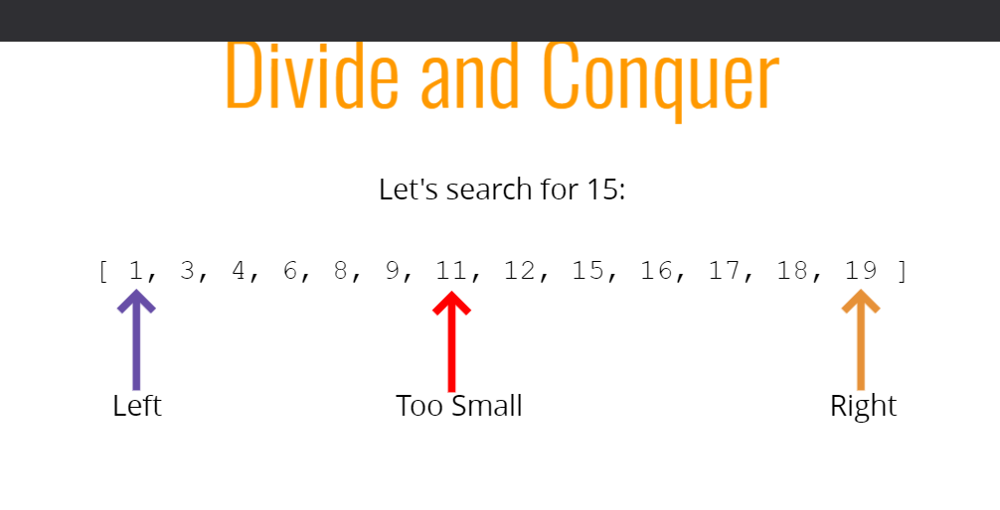
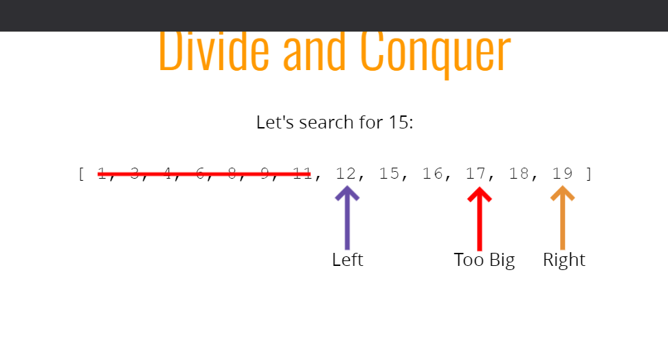
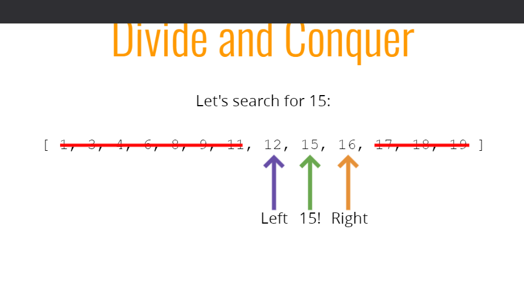
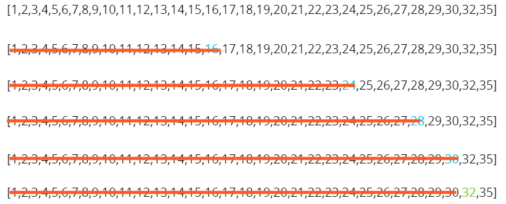

# Objectives

-   Describe what a searching algorithm is
-   Implement linear search on arrays
-   Implement binary search on sorted arrays
-   Implement a naive string searching algorithm
-   Implement the KMP string searching algorithm\

# How do we search?

Given an array, the simplest way to search for an value is to look at every element in the array and check if it's the value we want.

## JavaScript has search!

There are many different search methods on arrays in JavaScript:

-   indexOf
-   includes
-   find
-   findIndex

But how do these functions work?

# Linear Search

Let's search for 12:

[ 5, 8, 1, 100, 12, 3, 12 ]

-   5 is Not 12
-   8 is Not 12
-   1 is Not 12
-   100 is Not 12
-   12!!!!

## Linear Search Pseudocode

-   This function accepts an array and a value
-   Loop through the array and check if the current array element is equal to the value
-   If it is, return the index at which the element is found
-   If the value is never found, return -1

## Linear Search BIG O

| O(n) | O(n)    | O(1)  |
| ---- | ------- | ----- |
| Best | Average | Worst |

# Binary Search

-   Binary search is a much faster form of search
-   Rather than eliminating one element at a time, you can eliminate half of the remaining elements at a time
-   Binary search only works on sorted arrays!

## Binary Search Pseudocode

-   This function accepts a sorted array and a value
-   Create a left pointer at the start of the array, and a right pointer at the end of the array
-   While the left pointer comes before the right pointer:
    -   Create a pointer in the middle
    -   If you find the value you want, return the index
    -   If the value is too small, move the left pointer up
    -   If the value is too large, move the right pointer down
-   If you never find the value, return -1

# NOW LET'S DO IT RECURSIVELY!

## WHAT ABOUT BIG O?

| O(log n)               | O(1)      |
| ---------------------- | --------- |
| Worst and Average Case | Best Case |

## Suppose we're searching for 13

[2,4,5,9,11,14,15,19,21,25,28,30,50,52,60,63]

[2,4,5,9,11,14,15]

[11,14,15]

[11]

NOPE, NOT HERE!

16 elements = 4 "steps"

## To add another "step", we need to double the number of elements

Let's search for 32

32 elements = 5 "steps" (worst case)

## Naive String Search

-   Suppose you want to count the number of times a smaller string appears in a longer string
-   A straightforward approach involves checking pairs of characters individually

## Pseudocode

-   Loop over the longer string
-   Loop over the shorter string
-   If the characters don't match, break out of the inner loop
-   If the characters do match, keep going
-   If you complete the inner loop and find a match, increment the count of matches
-   Return the count

# KMP String Search

-   The Knutt-Morris-Pratt algorithm offers an improvement over the naive approach
-   Published in 1977
-   This algorithm more intelligently traverses the longer string to reduce the amount of redundant searching

[KPM Example slides](https://cs.slides.com/colt_steele/tries-21#/21/0/1)
