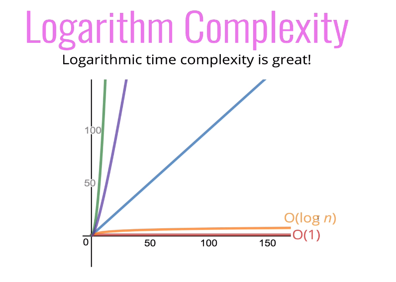
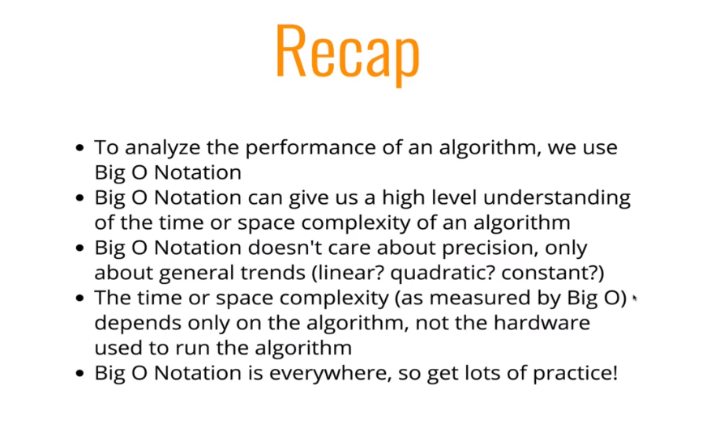

# Section 2: Big O Notation

## Official Intro to Big O

Big O Notation is a way to formalize fuzzy counting numbers

It allows us to talk formally about how the runtime of an algorithm grows as the inputs grow

**We don't care about the details, only the broad trends**

### Big O Definition

```
We say that anm algorithm is O(f(n)) if the number of simple operations the computer has to do is eventually less than a constant times f(n), as n increases
```

- f(n) could be linear (f(n)=n)
- f(n) could be quadratic (f(n)n<sup>2</sup>)
- f(n) could be constant (f(n)=1)
- f(n) could be something entirely different!

## Space Complexity

### Rules of thumb

- Most primitives (booleans, numbers, undefined, null) are constant space.
- Strings require O(n) space (where n is the string length)
- Reference types are generally O(n), where n is the length (for arrays) or the number of keys (for objects)

## Logarithms

We've encountered some of the most common complexities: O(1), O(n), O(n^2)

Sometimes big O expressions involve more complex mathematical expressions.

One that appears more often than you might like is the Logarithm.

### What, is a log again?

Log is the inverse of exponentiation.

log<sub>2</sub>(8)=3 -------> 2<sup>3</sup>=8

log<sub>2</sub>(value)=exponent -------> 2<sup>exponent</sup>=value

For the big picture, we are going to ignore the 2 and just write log




