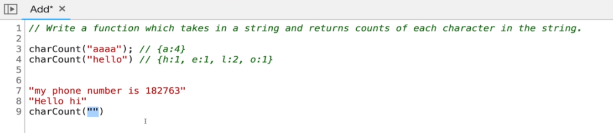

# Algorithms and Problem Solving Patterns

[Slides](https://cs.slides.com/colt_steele/problem-solving-patterns)

## OBJECTIVES

-   Define what an algorithm is
-   Devise a plan to solve algorithms
-   Compare and contrast problem solving patterns including frequency counters, two pointer problems and divide and conquer

## Step 1: Understand the problem

### WHAT IS AN ALGORITHM?

    A **process** or **set of steps** to accomplish a certain task.

### Why do I need to know this?

Almost **everything** that you do in programming involves some kind of **algorithm!**

**It's the <u>foundation</u> for being a successful problem solving and developer**

Also...

**_INTERVIEWS_**

### HOW DO YOU IMPROVE?

1. **Devise** a plan for solving problems
2. **Master** common problem solving patterns

### PROBLEM SOLVING STRATEGIES

##### A SIMPLE, FOOLPROOF, MAGICAL, MIRACULOUS, FAIL-SAFE APPROACH

### PROBLEM SOLVING

-   Understand the Problem
-   Explore Concrete Examples
-   Break It Down
-   Solve/Simplify
-   Look Back and Refactor

Note: many of these strategies are adapted from George Polya, whose book _How To Solve It_ is a great resource for anyone who wants to become a better problem solver

### UNDERSTAND THE PROBLEM

1. Can I restate the problem in my own words?
2. What are the inputs that go into the problem?
3. What are the outputs that should come from the solution to the problem?
4. Can the outputs be determined from the inputs? In other words, do I have enough information to solve the problem? (You may not be able to answer this question until you set about solving the problem. That's okay; it's still worth considering the question at this early stage.)
5. How should I label the important pieces of data that are a part of the problem?

### Write a function which takes two numbers and returns their sum.

1. Can I restate the problem in my own words?
    - "implement addition"
2. What are the inputs that go into the problem?
    - ints?
    - floats?
    - what about string for large numbers
3. What are the outputs that should come from the solution to the problem?
    - int? float? string?
4. Can the outputs be determined from the inputs? In other words, do I have enough information to solve the problem? (You may not be able to answer this question until you set about solving the problem. That's okay; it's still worth considering the question at this early stage.)

5. How should I label the important pieces of data that are a part of the problem?

## Step 2: CONCRETE EXAMPLES

Coming up with examples can help you understand the problem better

Examples also provide sanity checks that your eventual solution works how it should

-   User Stories!
-   Unit Tests!

### EXPLORE EXAMPLES

-   Start with Simple Examples
    -   Write it down, the easiest use cases
-   Progress to More Complex Examples
-   Explore Examples with Empty Inputs
-   Explore Examples with Invalid Inputs

### EXAMPLE

Write a function which takes in a string and returns counts of each character in the string.


## Step 3: BREAK IT DOWN

Explicitly write out the steps you need to take.

-   This forces you to think about the code you'll write before you write it, and helps you catch any lingering conceptual issues or misunderstandings before you dive in and have to worry about details (e.g. language syntax) as well.

```js
charCount("Hi There 1234")
{
   1: 1,
   2: 1,
   3: 1,
   4: 1,
   e: 2,
   h: 2,
   i: 1,
   r: 1,
   t: 1
}

function charCount(str) {
   //do something
   // return an object with keys that are lowercase alphanumeric characters in the string; values should be th

}

function charCount(str) {
   // make object to return at end
   // loop over strings, for each character...
      // if the char is a number/letter AND is a key in object, add one to counts
      // if the char is a number/letter AND is not in object, add it and set value to 1
      // if char is something else( space, period, etc. ) don't do anything.
   // return object at end
}
```

## Step 4: Solve or Simplify

Solve the problem... If you can't... Solve a simpler problem!

### Simplify

-   Find the core difficulty in what you're trying to do.
-   Temporarily ignore that difficulty
-   Write a simplified solution
-   Then incorporate that difficulty back in
